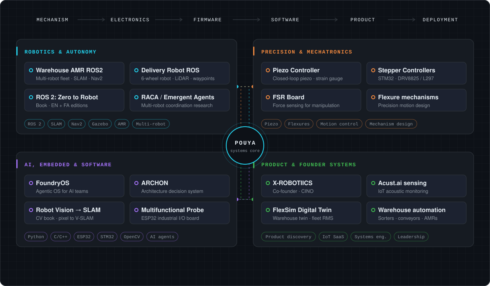
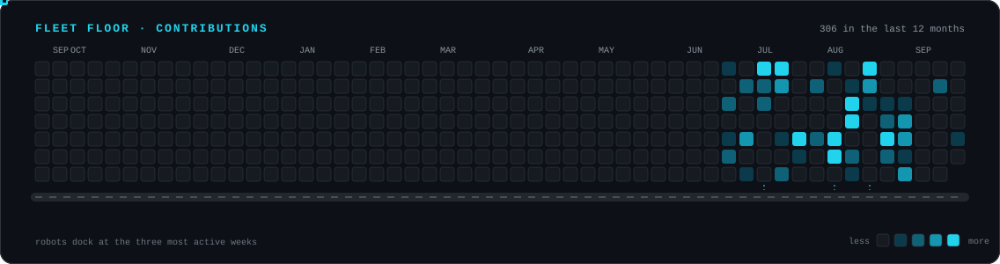

<!-- Profile README for github.com/Pouya-Mansournia. Assets are generated by scripts/generate_assets.py. -->

## About

- **Robotics & mechatronics engineer.** I design systems end to end: mechanism, electronics, firmware, software, and deployment.
- **Co-founder & CINO at X-ROBOTIICS**, previously Robotics & Automation Senior Manager at Digikala. I have led programs covering AGVs and AMRs, conveyors, wheel sorters, active rollers, and locally developed BLDC drives.
- **Autonomous mobile robots:** ROS 2 fleets with per-robot SLAM and Nav2, task assignment, and multi-robot coordination research.
- **Precision motion:** closed-loop piezo control with strain-gauge feedback, flexure mechanisms, and stepper and motor controllers on STM32.
- **Product engineering:** turning operational problems into architectures and products, from IoT sensing to agentic AI tooling.
- **Open source:** I write practical robotics books and publish simulation, research, and tooling code.

## Engineering system map

<table>
<tr>
<td width="25%" valign="top"> <b>Robotics</b> 
<a href="https://github.com/Pouya-Mansournia/warehouse-amr-ros2">Warehouse AMR ROS2</a> 
<a href="https://github.com/Pouya-Mansournia/Delivery-Robot-ROS">Delivery Robot ROS</a> 
<a href="https://github.com/Pouya-Mansournia/ros2-zero-to-robot">ROS 2: Zero to Robot</a> 
<a href="https://github.com/Pouya-Mansournia/RACA-Collective-Public">RACA Collective</a></td>
<td width="25%" valign="top"> <b>Precision</b> 
<a href="https://github.com/Pouya-Mansournia/Piezo-Controller">Piezo Controller</a> 
<a href="https://github.com/Pouya-Mansournia/Stepper-Motor-Controller-DRV8825">Stepper · DRV8825</a> 
<a href="https://github.com/Pouya-Mansournia/Stepper-motor-Controller-L297-L6201PS">Stepper · L297</a> 
<a href="https://github.com/Pouya-Mansournia/FSR">FSR Board</a></td>
<td width="25%" valign="top"> <b>AI & software</b> 
<a href="https://github.com/Pouya-Mansournia/FoundryOS">FoundryOS</a> 
<a href="https://github.com/Pouya-Mansournia/ARCHON">ARCHON</a> 
<a href="https://github.com/Pouya-Mansournia/robot-vision-zero-to-slam">Robot Vision → SLAM</a> 
<a href="https://github.com/Pouya-Mansournia/multifunctional-probe">Multifunctional Probe</a></td>
<td width="25%" valign="top"> <b>Product</b> 
<a href="https://mansournia.info/">X-ROBOTIICS</a> 
<a href="https://github.com/Pouya-Mansournia/grafana-dashboard">Acust.ai sensing</a> 
<a href="https://github.com/Pouya-Mansournia/flexsim-digital-twin">FlexSim Digital Twin</a> 
<a href="https://github.com/Pouya-Mansournia/acoustic-exposure-dynamics-dataset">Acoustic dataset</a></td>
</tr>
</table>

## Featured projects

<table>
<tr>
<td width="50%" valign="top">
 <a href="https://github.com/Pouya-Mansournia/ros2-zero-to-robot"><b>ROS 2: Zero to Robot</b></a> 
A practical, project-based book that goes from your first node to simulating, navigating, and deploying autonomous mobile robots. Also available in <a href="https://github.com/Pouya-Mansournia/ros2-zero-to-robot-fa">Persian</a>. 
ROS 2 · URDF · Gazebo · SLAM · Nav2 · deployment
</td>
<td width="50%" valign="top">
 <a href="https://github.com/Pouya-Mansournia/warehouse-amr-ros2"><b>Warehouse AMR ROS2</b></a> 
Multi-robot warehouse fleet simulation with a CAD-accurate differential-drive robot, per-robot SLAM Toolbox and Nav2, and task assignment with station reservation. 
ROS 2 Jazzy · Gazebo Sim · SLAM Toolbox · Nav2
</td>
</tr>
<tr>
<td valign="top">
 <a href="https://github.com/Pouya-Mansournia/Delivery-Robot-ROS"><b>Delivery Robot ROS</b></a> 
Simulation of a six-wheel autonomous delivery robot with CAD meshes, LiDAR obstacle avoidance, teleop, and city waypoint navigation. 
ROS 2 Jazzy · Gazebo Harmonic · LiDAR · waypoints
</td>
<td valign="top">
 <a href="https://github.com/Pouya-Mansournia/Piezo-Controller"><b>Piezo Controller</b></a> 
Closed-loop controller for piezo stacks with a wide voltage range, strain-gauge feedback, and Ethernet link to a host PC. 
STM32 · closed-loop control · strain gauges · Ethernet
</td>
</tr>
<tr>
<td valign="top">
 <a href="https://github.com/Pouya-Mansournia/RACA-Collective-Public"><b>RACA Collective</b></a> 
Multi-robot research into when LLM reasoning actually helps: cognitive delegation, behavioral specialization, and reproducible experiments. See also <a href="https://github.com/Pouya-Mansournia/warehouse-amr-emergent-agents-public">emergent agents</a>. 
Python · multi-agent simulation · LLM routing
</td>
<td valign="top">
 <a href="https://github.com/Pouya-Mansournia/FoundryOS"><b>FoundryOS</b></a> 
Open-source agentic operating system for building AI teams from modular skills, agents, meta-agents, workflows, and memory. 
Python · AI agents · workflow automation
</td>
</tr>
<tr>
<td valign="top">
 <a href="https://github.com/Pouya-Mansournia/flexsim-digital-twin"><b>FlexSim Digital Twin</b></a> 
Warehouse digital twin with a Python/FastAPI bridge, a live dashboard, and a robot management system for fleet scheduling. 
FlexSim · FastAPI · fleet orchestration
</td>
<td valign="top">
 <a href="https://github.com/Pouya-Mansournia/robot-vision-zero-to-slam"><b>Robot Vision: Zero to SLAM</b></a> 
Free bilingual (EN/FA) book on computer vision for robotics, from a single pixel to visual SLAM and ROS 2, with a runnable project in every chapter. 
OpenCV · visual SLAM · ROS 2
</td>
</tr>
</table>

## Technology stack

| Purpose | Tools and methods |
|---|---|
| **Robotics & autonomy** | ROS 2 · Nav2 · SLAM Toolbox · Gazebo · URDF · multi-robot coordination |
| **Embedded & electronics** | STM32 · ESP32 · AVR · C / C++ · PCB design (Altium) · motor control · Ethernet · Wi-Fi · GSM / GPS · MQTT |
| **Mechanical & precision** | SolidWorks · mechanism design · flexures · piezo actuation · closed-loop positioning |
| **AI & software** | Python · OpenCV · YOLO · FastAPI · Docker · Cloudflare Workers · AI agents · GitHub Actions |
| **Product & systems** | Systems architecture · product discovery · IoT products · FMEA · cross-functional team leadership |

## Open source & education

**ROS 2: Zero to Robot** ([English](https://github.com/Pouya-Mansournia/ros2-zero-to-robot) · [Persian](https://github.com/Pouya-Mansournia/ros2-zero-to-robot-fa) · [read online](https://pouya-mansournia.github.io/ros2-zero-to-robot/)): a practical path from zero ROS 2 knowledge to real robot deployment.
Companion books: [Robot Vision: Zero to SLAM](https://github.com/Pouya-Mansournia/robot-vision-zero-to-slam) and [Advanced Mobile Robotics](https://github.com/Pouya-Mansournia/advanced-mobile-robotics-book).

## GitHub activity

<picture>
  <source media="(prefers-color-scheme: light)" srcset="assets/contribution-system-light.svg" />
  
</picture>

Both graphics are generated daily from the GitHub GraphQL API by <a href="scripts/generate_assets.py">scripts/generate_assets.py</a>.

## Current focus

- Multi-robot coordination and when reasoning is worth its cost ([RACA](https://github.com/Pouya-Mansournia/RACA-public))
- Warehouse fleets: simulation, digital twins, and scheduling
- Robotics education in English and Persian
- AI-assisted engineering decision systems ([ARCHON](https://github.com/Pouya-Mansournia/ARCHON))

Open to research collaborations and PhD opportunities in Europe.

 
<a href="https://mansournia.info/">mansournia.info</a> · <a href="https://www.linkedin.com/in/pouya-mansournia/">LinkedIn</a> · <a href="mailto:p.mansournia@gmail.com">p.mansournia@gmail.com</a>

