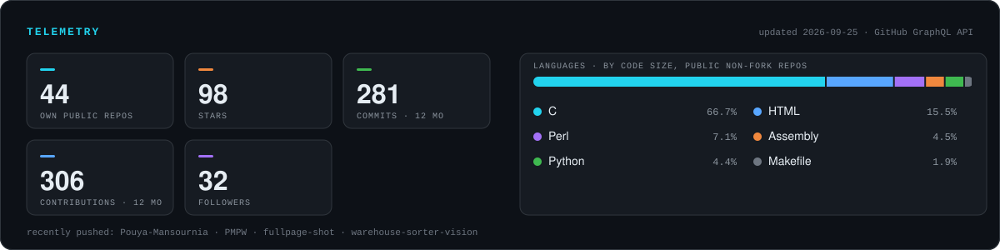

<!--
Profile README for github.com/Pouya-Mansournia
-->

 

  

 

---

## About Me

I am a robotics and mechatronics engineer focused on designing production-oriented systems that connect mechanical engineering, electronics, embedded control, artificial intelligence, and product architecture.

My work spans mobile robots, AGV and AMR platforms, industrial automation, precision positioning systems, embedded electronics, IoT products, and AI-assisted engineering workflows.

- Co-Founder & CINO at **X-ROBOTIICS**
- Former Robotics & Automation Senior Manager at **Digikala**
- Experienced in leading multidisciplinary engineering projects from concept and prototyping to field deployment
- Interested in robotics research, intelligent automation, precision mechanisms, embedded systems, and AI-native product development
- Open to research collaborations and PhD opportunities in Europe

---

## Engineering System Map

```mermaid
flowchart TB
    CORE(("POUYA<br/>Systems Engineer"))

    CORE --> ROB["🤖 Robotics &<br/>Autonomous Systems"]
    CORE --> PREC["⚙️ Precision Engineering<br/>& Mechatronics"]
    CORE --> AI["🧠 AI, Embedded &<br/>Software Systems"]
    CORE --> PROD["🚀 Product & Founder<br/>Systems"]

    ROB --> R1["Warehouse AMR ROS2"]
    ROB --> R2["Delivery Robot ROS"]
    ROB --> R3["ROS 2: Zero to Robot"]

    PREC --> P1["Piezo Controller"]
    PREC --> P2["Flexure Mechanisms"]

    AI --> A1["FoundryOS"]
    AI --> A2["ARCHON"]
    AI --> A3["Multifunctional Probe"]

    PROD --> D1["X-ROBOTIICS"]
    PROD --> D2["PulseTask"]

    click R1 "https://github.com/Pouya-Mansournia/warehouse-amr-ros2" _blank
    click R2 "https://github.com/Pouya-Mansournia/Delivery-Robot-ROS" _blank
    click R3 "https://pouya-mansournia.github.io/ros2-zero-to-robot/" _blank
    click P1 "https://github.com/Pouya-Mansournia/Piezo-Controller" _blank
    click A1 "https://github.com/Pouya-Mansournia/FoundryOS" _blank
    click A2 "https://github.com/Pouya-Mansournia/ARCHON" _blank
    click A3 "https://github.com/Pouya-Mansournia/multifunctional-probe" _blank
    click D1 "https://mansournia.info/" _blank
    click D2 "https://github.com/Pouya-Mansournia/PulseTask" _blank

    classDef core fill:#67e8f9,stroke:#0e7490,stroke-width:2px,color:#0f172a,font-weight:bold
    classDef robotics fill:#7dd3fc,stroke:#0284c7,stroke-width:1.5px,color:#0f172a
    classDef precision fill:#fdba74,stroke:#ea580c,stroke-width:1.5px,color:#0f172a
    classDef ai fill:#c4b5fd,stroke:#7c3aed,stroke-width:1.5px,color:#0f172a
    classDef product fill:#86efac,stroke:#16a34a,stroke-width:1.5px,color:#0f172a

    class CORE core
    class ROB,R1,R2,R3 robotics
    class PREC,P1,P2 precision
    class AI,A1,A2,A3 ai
    class PROD,D1,D2 product
```

The map groups active work into four domains — robotics & autonomy, precision mechatronics, AI/embedded software, and product/founder systems. Click any project node to open its repository.

---

## Current Focus

- Autonomous mobile robots and intelligent robotic systems
- Robotics system architecture and multidisciplinary product development
- Embedded systems, sensing, control, and edge intelligence
- Industrial automation and warehouse robotics
- Precision mechatronics and piezo-actuated mechanisms
- Agentic AI systems and engineering decision-support tools
- Open-source tools for technical founders and engineering teams

---

## Featured Open-Source Projects

### [Delivery Robot ROS](https://github.com/Pouya-Mansournia/Delivery-Robot-ROS)

A ROS-based delivery robot project covering navigation, localization, and autonomous mobility for last-mile delivery applications.

**Focus:** ROS · Autonomous Mobile Robots · Navigation · Delivery Robotics

---

### [FoundryOS](https://github.com/Pouya-Mansournia/FoundryOS)

An open-source agentic operating system for building modular AI teams using skills, agents, meta-agents, workflows, memory, brand systems, and reusable commands.

**Focus:** Agentic AI · AI Engineering · Workflow Automation · Knowledge Systems

---

### [ARCHON](https://github.com/Pouya-Mansournia/ARCHON)

A Principal Engineer and CTO decision system for making production-grade architecture, cloud, AI, robotics, security, and scaling decisions before implementation.

**Focus:** Software Architecture · System Design · Technical Strategy · Engineering Decisions

---
### [Warehouse AMR ROS2](https://github.com/Pouya-Mansournia/warehouse-amr-ros2)

A ROS2-based autonomous mobile robot platform for warehouse navigation, mapping, and fleet automation, designed for modular AMR research and deployment.

**Focus:** ROS2 · Autonomous Mobile Robots · Navigation · Warehouse Automation

---

### [ROS2 Zero to Robot](https://pouya-mansournia.github.io/ros2-zero-to-robot/)

A hands-on ROS 2 learning journey from foundational concepts to autonomous robot applications, including navigation, perception, and system integration.

**Focus:** ROS2 · Robotics Education · Autonomous Systems · Embedded Robotics

---

### [PulseTask](https://github.com/Pouya-Mansournia/PulseTask)

A lightweight, single-user productivity, mood, and energy tracking system built with Telegram, Cloudflare Workers, Google Apps Script, and Google Sheets.

**Focus:** Personal Automation · Serverless Systems · Telegram Bots · Productivity Analytics

---

### [Multifunctional Probe](https://github.com/Pouya-Mansournia/multifunctional-probe)

An ESP32-based industrial interface board supporting isolated digital inputs, relay outputs, and 12–24 V operation.

**Focus:** Embedded Systems · ESP32 · Industrial Electronics · PCB Design

---

### [Piezo Controller](https://github.com/Pouya-Mansournia/Piezo-Controller)

A closed-loop embedded controller for piezoelectric actuators with strain-gauge feedback and Ethernet connectivity.

**Focus:** Precision Mechatronics · STM32 · Closed-Loop Control · Piezoelectric Systems

---

### [Advanced Mobile Robotics Book](https://github.com/Pouya-Mansournia/advanced-mobile-robotics-book)

An open-source book covering advanced concepts in mobile robotics, from theory to practical implementation.

**Focus:** Mobile Robotics · Robotics Education · Open-Source Knowledge

---

## Selected Engineering Experience

- Designed and developed AGV, AMR, delivery robot, and warehouse automation systems
- Led engineering programs involving conveyor systems, wheel sorters, active rollers, and locally developed BLDC drives
- Developed precision flexure mechanisms and closed-loop piezoelectric positioning systems
- Built embedded products using STM32, ESP32, AVR, industrial sensors, Ethernet, GSM, GPS, and real-time control
- Managed cross-functional teams across mechanics, electronics, firmware, software, control, manufacturing, and operations
- Translated operational challenges into scalable technical architectures and deployable products

---

## Engineering Domains

| Robotics & Mechatronics | Embedded & Electronics | AI & Software | Product & Systems |
|---|---|---|---|
| Mobile Robots | STM32 / ESP32 / AVR | Python | System Architecture |
| AGV / AMR | PCB Design | Agentic AI | Product Development |
| Mechanism Design | Sensors & Actuators | Cloudflare Workers | Technical Strategy |
| Precision Systems | Motor Control | Google Apps Script | FMEA & Risk Analysis |
| Control Systems | IoT & Connectivity | Automation Workflows | Cross-functional Leadership |
| Industrial Automation | Embedded Firmware | Data Pipelines | Prototyping to Deployment |

---

## Technology Stack

### Robotics, Mechanical, and Simulation

### Embedded Systems and Electronics

### AI, Software, and Infrastructure

---

## GitHub Activity

Generated locally from the GitHub API by <a href="scripts/generate_stats_svg.py">scripts/generate_stats_svg.py</a> and refreshed on a schedule — no third-party stats service dependency.

---

## Collaboration

I am interested in collaborating on:

- Robotics and autonomous systems
- Industrial automation and smart manufacturing
- Embedded AI and intelligent sensing
- Precision mechatronics and advanced mechanisms
- Open-source AI engineering tools
- Research and technology-driven startup projects

For professional inquiries, research collaboration, or technical discussions, connect with me through [LinkedIn](https://www.linkedin.com/in/pouya-mansournia/) or visit [mansournia.info](https://mansournia.info/).

---

### Engineering intelligent systems from first principles to real-world deployment.

